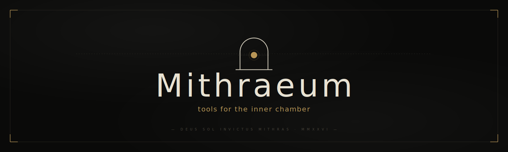

<p align="center">
  <a href="https://mithraeums.github.io">
    
  </a>
</p>

<p align="center">
  <em>Tools for the inner chamber. Quiet software for people who write code by hand.</em>
</p>

<p align="center">
  <a href="https://mithraeums.github.io"></a>
  <a href="https://github.com/mithraeums"></a>
  
  
</p>

<br>

<p align="center"><sub><b>—— I ——</b></sub></p>

## Suite

<table>
  <tr>
    <td width="40" align="center"><sub><b>I</b></sub></td>
    <td width="200"><b><a href="https://github.com/mithraeums/hako">hako</a></b><br/><sub>箱 · the box</sub></td>
    <td>Modal text editor in a single C file. Vim-bound, language-aware, 17 themes. <code>:rei</code> answers from inside.</td>
    <td align="right"><sub>v0.0.9</sub></td>
  </tr>
  <tr>
    <td align="center"><sub><b>II</b></sub></td>
    <td><b><a href="https://github.com/mithraeums/hakoCLAW">hakoCLAW</a></b><br/><sub>爪 · the claw</sub></td>
    <td>Standalone terminal AI agent. Same C99 stack. 13+ providers, persistent sessions, sha-verified self-update.</td>
    <td align="right"><sub>v0.1.2</sub></td>
  </tr>
  <tr>
    <td align="center"><sub><b>III</b></sub></td>
    <td><b><a href="https://github.com/mithraeums/hakoAI">hakoAI</a></b><br/><sub>· in officina ·</sub></td>
    <td>Local models, trained for the cursor. Repo opens with the first weights.</td>
    <td align="right"><sub><em>private</em></sub></td>
  </tr>
  <tr>
    <td align="center"><sub><b>·</b></sub></td>
    <td><b><a href="https://github.com/mithraeums/skills">skills</a></b><br/><sub>技 · behaviors</sub></td>
    <td>Markdown skills for claw and hako. PR-driven catalog. corp is the inaugural entry.</td>
    <td align="right"><sub>pre-1.0</sub></td>
  </tr>
</table>

<p align="center"><sub><b>—— II ——</b></sub></p>

## Install

### hakoCLAW

```sh
curl -fsSL https://mithraeums.github.io/hakoCLAW.sh | sh
```

<p align="center">
  <sub><b>macOS</b> universal2 &nbsp;·&nbsp; <b>Linux</b> x86_64 / arm64 &nbsp;·&nbsp; <b>FreeBSD</b> x86_64 &nbsp;·&nbsp; <b>Windows</b> MinGW &nbsp;·&nbsp; <b>iSh</b></sub>
</p>

### hako

```sh
curl -fsSL https://mithraeums.github.io/hako.sh | sh
```

<p align="center">
  <sub><b>macOS</b> universal2 &nbsp;·&nbsp; <b>Linux</b> x86_64 / arm64 &nbsp;·&nbsp; <b>FreeBSD</b> x86_64 &nbsp;·&nbsp; <b>Windows</b> MinGW &nbsp;·&nbsp; <b>iSh</b></sub>
</p>

<p align="center"><sub><b>—— III ——</b></sub></p>

## Motive

<table>
  <tr>
    <td width="33%" valign="top"><b>I · Local first.</b><br/><sub>Your text, your keys, your weights. No telemetry. No silent network. The cursor is a private place.</sub></td>
    <td width="33%" valign="top"><b>II · Single binary.</b><br/><sub>One file. One C source. No JavaScript runtime to swallow your editor. The tool fits in a head.</sub></td>
    <td width="33%" valign="top"><b>III · Bring your own deity.</b><br/><sub>Any model. Any provider. Any prompt. The agent is a peer at your terminal, not a stranger in the cloud.</sub></td>
  </tr>
</table>

<p align="center"><sub><b>—— IV ——</b></sub></p>

## Site

`index.html` is the source for [mithraeums.github.io](https://mithraeums.github.io). `install.sh` is a thin proxy to the canonical claw installer in [`mithraeums/hakoCLAW`](https://github.com/mithraeums/hakoCLAW). Banner SVGs in `assets/` are referenced by every project README.

<p align="center"><sub><a href="LICENSE">— SEE LICENSE —</a> &nbsp;·&nbsp; GPL-3.0 &nbsp;·&nbsp; copyleft</sub></p>

<p align="center"><sub><em>— deus sol invictus mithras —</em></sub></p>
